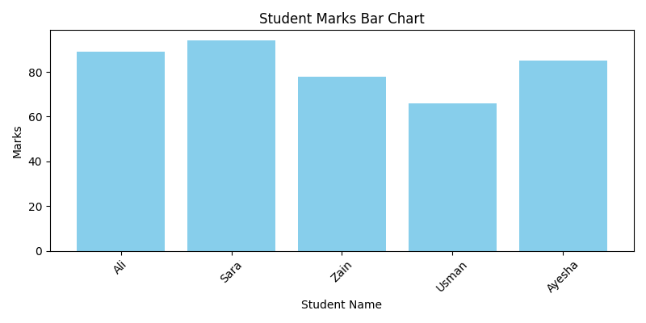

# 📘 Student Marks Analysis

This project performs a basic analysis on student marks using Python, Pandas, and Matplotlib.  
It reads data from a CSV file, calculates average marks, finds high scorers, and generates a summary with visualization.

---

## 📁 Files Included

| File Name               | Description |
|------------------------|-------------|
| `student.csv`           | Original dataset of student names and marks |
| `high_scorers.csv`      | Filtered students who scored above 80 |
| `student_analysis.ipynb`| Jupyter Notebook with full analysis code |
| `graph.png`             | Bar chart showing marks distribution |

---

## 📊 Output Graph Preview

This chart shows the marks of each student for visual comparison.

---

## 🔧 Technologies Used

- Python 3
- Pandas (for data manipulation)
- Matplotlib (for visualization)
- Jupyter Notebook

---

## 🎯 Features

- Calculate total students and average marks
- Identify students scoring above a certain threshold
- Visualize student performance in a bar chart
- Export filtered data to a new CSV file

---

## 💡 What I Learned

- Working with CSV files in Pandas
- Filtering and analyzing data with conditions
- Visualizing data using bar plots
- File writing and basic data science structure

---

## 👨‍💻 Author

**Shelly Garg**  
Aspiring Data Engineer | [GitHub]((https://github.com/Shelly74))
